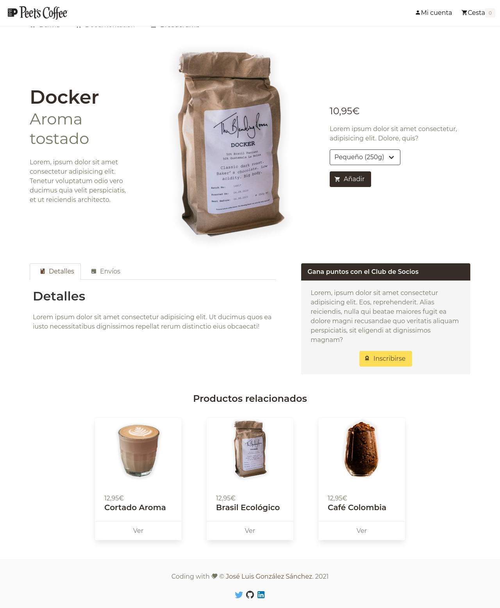
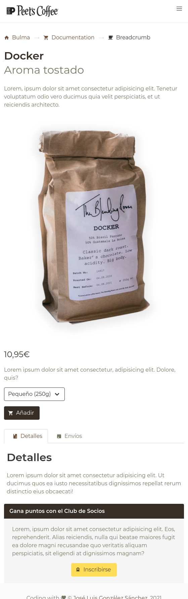
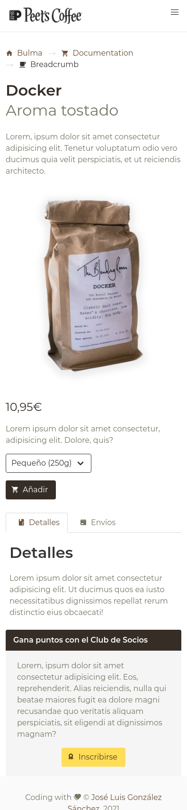

# Bulma - Product Page

Ejemplo de como crear una página de producto usando Bulma y personalizando con Sass y Vanilla JS. Automatizado con Gulp.

[](https://bulma.io/made-with-bulma/)
[](https://sass-lang.com/)
[](https://gulpjs.com/)
[](./LICENSE)


## Acerca de

Pagina web de un producto realizada con [Bulma](https://bulma.io/) y cambiar su apariencia con Sass. La intercatividad está realizada con Vanila JS. Para ello se ha creado una serie de tareas automatizadas con [Gulp](https://gulpjs.com/) y se ha añadido como iconos [Font Awesome](https://fontawesome.com/)/[Material Desing Icons](https://materialdesignicons.com/) cambíandolos desde el fichero HTML, o simplemente pudiendo elegir ambos si se quiere.

### Capturas




## Funcionamiento con npm:

#### Setup y configuración de librerías

```bash
$npm install
```

#### Modo de desarrollo y live server

```bash
$npm start
$npm run serve
```

#### Limpieza de assets y directorio de distribición

```bash
$npm run clean
```

## Autor

Codificado con :sparkling_heart: por [José Luis González Sánchez](https://twitter.com/joseluisgonsan)

 

## Licencia

Este proyecto esta licenciado bajo licencia **MIT**, si desea saber más, visite el fichero [LICENSE](./LICENSE) para su uso docente y educativo.

### Agradecimientos
Proyecto basado en los tutoriales de [Net Ninja](https://www.thenetninja.co.uk/)
